# 浙大区块链实验室
---
本文将介绍区块链的使用，以帮助读者理解资产创建、发行、交易的整个流程。
## 准备
配置数据库
* 下载并安装mongodb  
* [mongodb安装地址](https://www.mongodb.com/download-center#community) 

部署项目
* 安装nodejs  
* [nodejs安装地址](https://nodejs.org/zh-cn/)
* 安装bower
* [bower安装地址](https://bower.io/)
* 安装依赖并启动 `npm start`
* 端口访问 `localhost:3000`

---
## 简介
```
这里我们采用固定合约源码并给出了编译合约生成的的abi(合约源码对应的abi数组)以及bin（合约编译而成的字节码）,这里用户也可以自己给定合约源码以及编译生成的bin，abi。
const TOKEN_SOURCE = 'contract Token {     address issuer;     mapping (address => uint) balances;      event Issue(address account, uint amount);     event Transfer(address from, address to, uint amount);      function Token() {         issuer = msg.sender;     }      function issue(address account, uint amount) {         if (msg.sender != issuer) throw;         balances[account] += amount;     }      function transfer(address to, uint amount) {         if (balances[msg.sender] < amount) throw;          balances[msg.sender] -= amount;         balances[to] += amount;          Transfer(msg.sender, to, amount);     }      function getBalance(address account) constant returns (uint) {         return balances[account];     } }';
const TOKEN_BIN = '0x6060604052341561000c57fe5b5b60008054600160a060020a03191633600160a060020a03161790555b5b6101ca806100396000396000f300606060405263ffffffff60e060020a600035041663867904b48114610037578063a9059cbb14610058578063f8b2cb4f14610079575bfe5b341561003f57fe5b610056600160a060020a03600435166024356100a7565b005b341561006057fe5b610056600160a060020a03600435166024356100e6565b005b341561008157fe5b610095600160a060020a036004351661017f565b60408051918252519081900360200190f35b60005433600160a060020a039081169116146100c35760006000fd5b600160a060020a03821660009081526001602052604090208054820190555b5050565b600160a060020a0333166000908152600160205260409020548190101561010d5760006000fd5b600160a060020a0333811660008181526001602090815260408083208054879003905593861680835291849020805486019055835192835282015280820183905290517fddf252ad1be2c89b69c2b068fc378daa952ba7f163c4a11628f55a4df523b3ef9181900360600190a15b5050565b600160a060020a0381166000908152600160205260409020545b9190505600a165627a7a72305820299e9bb6a492d60cb690d97c76ac26d821ff6bba1b863ce1b8720e449789692c0029'
const TOKEN_ABI = '[{"constant":false,"inputs":[{"name":"account","type":"address"},{"name":"amount","type":"uint256"}],"name":"issue","outputs":[],"payable":false,"type":"function"},{"constant":false,"inputs":[{"name":"to","type":"address"},{"name":"amount","type":"uint256"}],"name":"transfer","outputs":[],"payable":false,"type":"function"},{"constant":true,"inputs":[{"name":"account","type":"address"}],"name":"getBalance","outputs":[{"name":"","type":"uint256"}],"payable":false,"type":"function"},{"inputs":[],"payable":false,"type":"constructor"},{"anonymous":false,"inputs":[{"indexed":false,"name":"account","type":"address"},{"indexed":false,"name":"amount","type":"uint256"}],"name":"Issue","type":"event"},{"anonymous":false,"inputs":[{"indexed":false,"name":"from","type":"address"},{"indexed":false,"name":"to","type":"address"},{"indexed":false,"name":"amount","type":"uint256"}],"name":"Transfer","type":"event"}]'


```
## 注册

```
 打开实验室链接地址，并利用手机号码注册一个交易帐号,同时会生成账号的地址address。

```
```
这里要调用远程api createaccount接口生成账户地址信息
  request({
                url: "https://api.hyperchain" + "/v1/dev/account/create" ,
                method: "GET",
                json: true,
                headers: {
                    "Accept": "Accept: text/html",
                    "Authorization": accessToken
                }
            },
```

[实验室链接地址](http://localhost:3000)

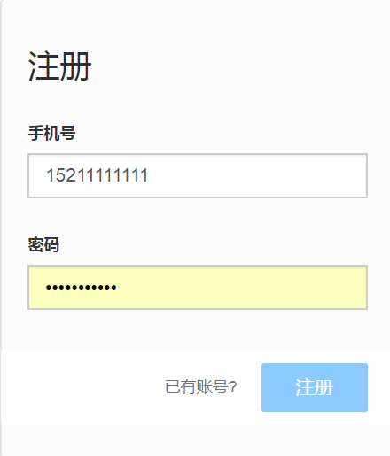
---

## 登录
```
登录已注册的账号
```
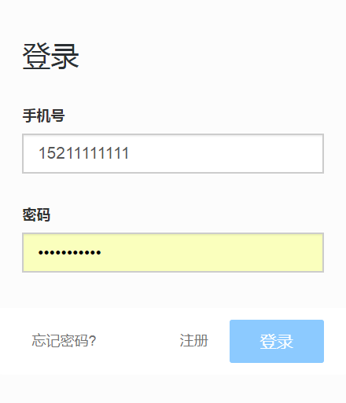

---
## 账户信息
```
账户信息,包括账户名称，交易地址，通过地址能够进行后续的创建货币、发行货币以及进行交易
```
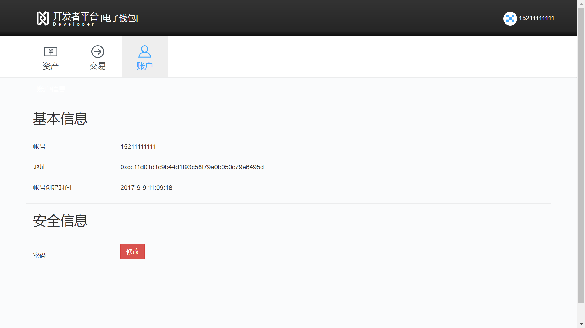

---

## 创建资产
```
这里创建资产需要填写资产的名称，资产的单位以及资产的描述信息，填写之后点击创建按钮，  
就能够创建一份我们自定义的财产，同时页面跳转到资产的详细信息。资产列表新加一项内容，  
后台将合约源码部署到了区块链上，之后我们能够进行发行以及交易等操作。
```
```
调用远程api deploy接口将合约部署到区块链上
 request({
            url: "https://api.hyperchain" + "/v1/dev/contract/deploy",
            method: "POST",
            json: true,
            headers: {
                "content-type": "application/json",
                "Accept": "application/json",
                "Authorization": accessToken
            }
            , body: requestData
        }
```
```
资产详情中我们能够看到资产的名称等信息，主要信息为资产的地址即为合约部署到区块链上的地址，  
发行方账户地址即为我们发行账户的地址。但是发行总数量以及资产余额为零，这些值的改变需要后  
续发行资产等操作。
```
* 填写资产信息
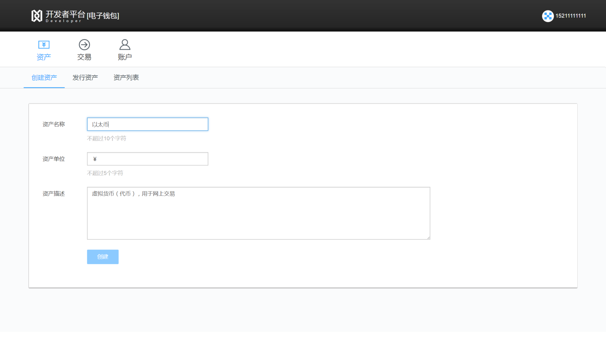
---
## 发行资产

```
发行资产为根据方法方账户以及合约的地址发行的资产，该资产为发行方自定义的资产，可以指定资产的总数，  
这里我们发行100000个货币。资产详情中有我们发行的资产的详细信息，资产地址为我们部署到区块链上的地址。
```
```
发行资产对应着合约中abi的一下部分，主要使用了源码中发行（issue）方法发行货币，可以通过abi等信息生成payload用于invokecontract（调用合约）使用
    var theAbi = {
        "constant": false,
        "inputs": [{"name": "account", "type": "address"}, {"name": "amount", "type": "uint256"}],
        "name": "issue",
        "outputs": [],
        "payable": false,
        "type": "function"
    };
    var methodParams = [from, amount];
    ...
    var encodedparams = encodeMethodParams(theAbi, methodParams);
      request({
            url: "https://api.hyperchain" + "/v1/dev/contract/invoke",
            method: "POST",
            json: true,
            headers: {
                "content-type": "application/json",
                "Accept": "application/json",
                "Authorization": accessToken
            }
            , body: requestData
        }
    
```

* 发行资产
* 
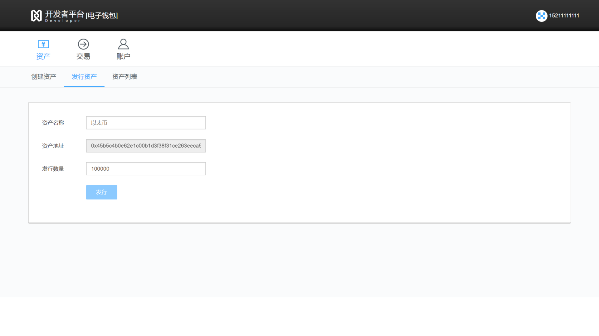
* 资产详情
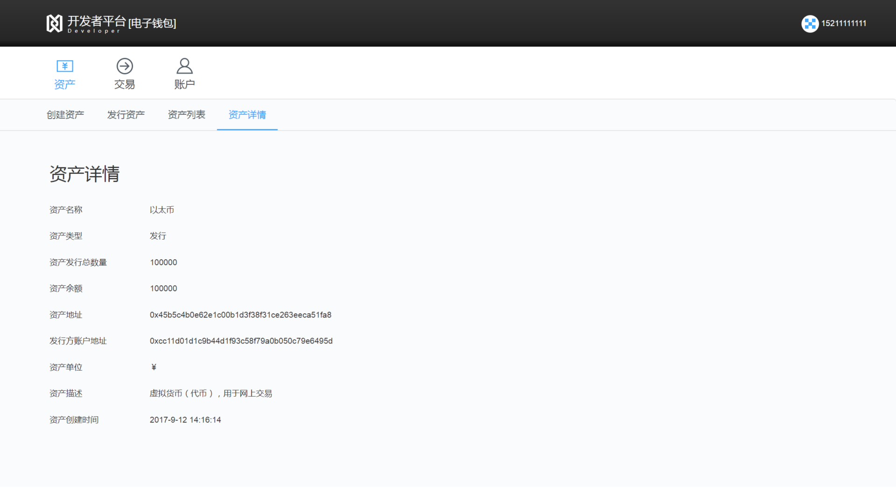
---
## 交易
```
这里注册另一个账户后可以实现账户之间的交易,首先我们注册另一个账户，账户1，输入交易金融5000以及  
对方账户地址之后发起交易。账户2，得到交易金额5000以及交易详细信息。此时账户1的金额会减少5000在  
交易详细信息中能够看到，账户2的交易信息增加5000，交易详情中能够看到
```
```
账户1交易详情中能够看到资产名称为我们定义好的比特币，交易hash为这次交易生成的交易hash，转出数量  
为5000，对方账号以及地址。发行方即为我们的账号以及地址。
```
```
账户2交易详情中能够看到资产名称为比特币，资产类型为转入，资产余额为账户1中转入的5000，资产地址  
为资产在合约上的地址，发行方地址为账户1的地址，还要单位以及资产描述等信息。
```
```
abi采用以下方式，主要使用了源码中的交易（Transfer）的方法，调用交易的账号会减少相关的金额，目标账户增加相应的金额，使用以下abi生成对应的payload接下来调用合约（invokecontract）完成交易
    var theAbi = {
        "constant": false,
        "inputs": [{"name": "to", "type": "address"}, {"name": "amount", "type": "uint256"}],
        "name": "transfer",
        "outputs": [],
        "payable": false,
        "type": "function"
    };

    var methodParams = [to, amount];
    var encodedparams = encodeMethodParams(theAbi, methodParams);
    ...
     request({
            url: "https://api.hyperchain" + "/v1/dev/contract/invoke",
            method: "POST",
            json: true,
            headers: {
                "content-type": "application/json",
                "Accept": "application/json",
                "Authorization": accessToken
            }
            , body: requestData
        }
```
* 注册账户
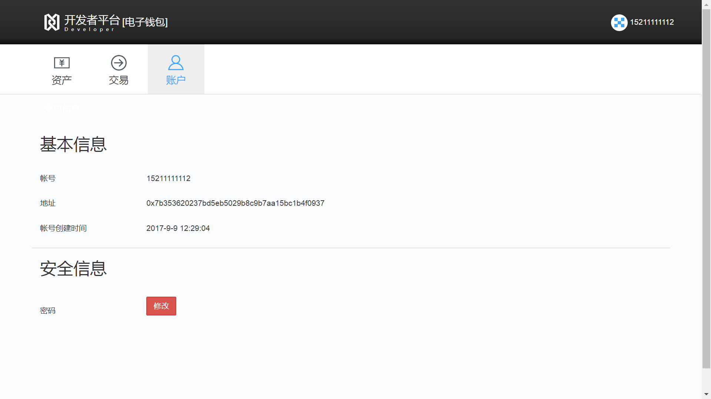
* 账户1发起交易
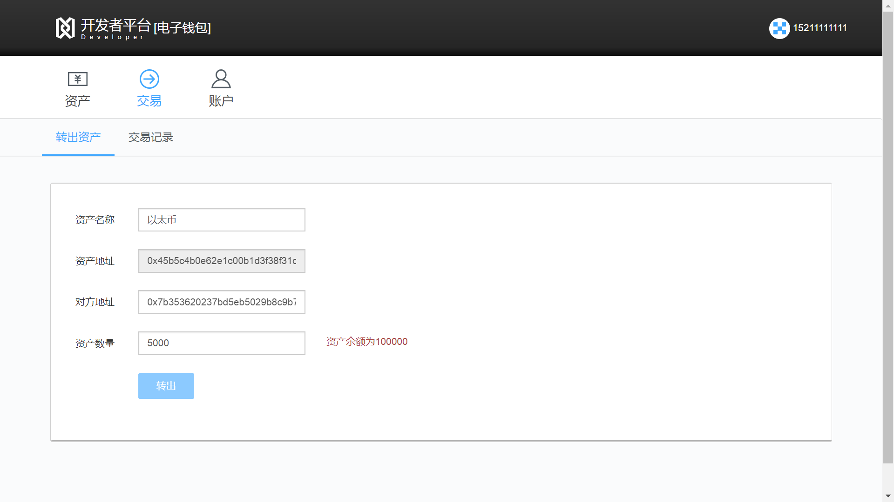
* 账户1发起交易详情

* 账户2接收交易详情


## 资产列表
```
资产列表中能够看到账户的全部发行资产以及交易等信息点击进去可以看到交易详情。
```
* 账户1资产列表
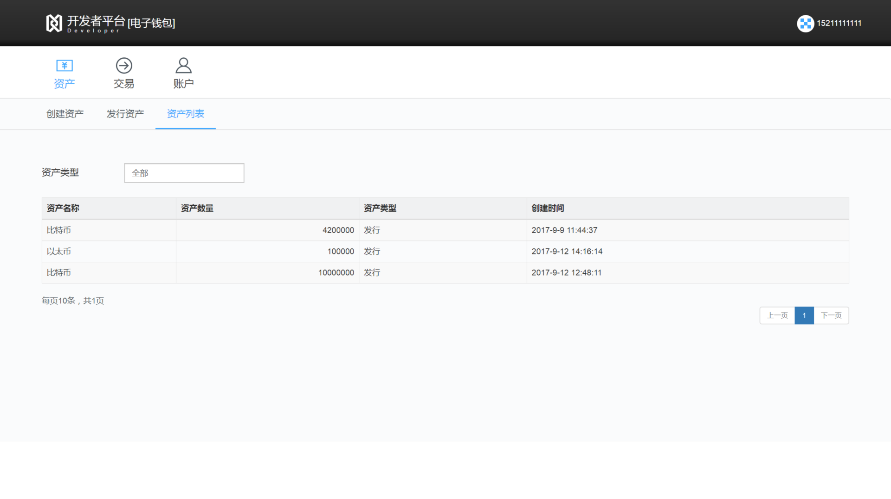
* 账户2资产列表
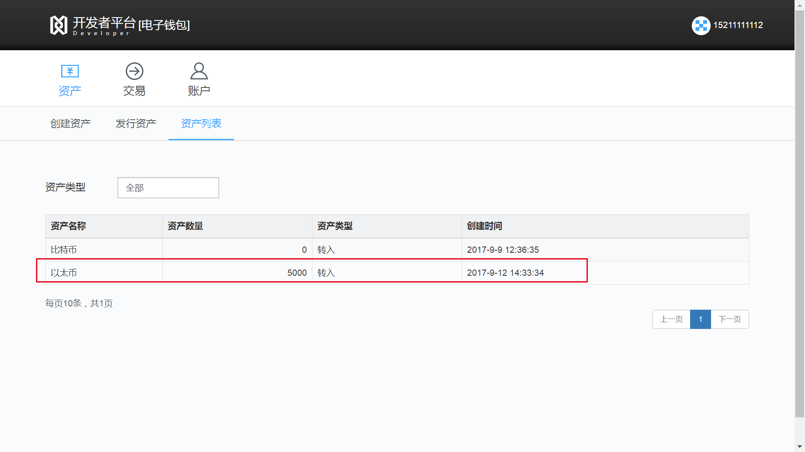
* 账户1交易记录
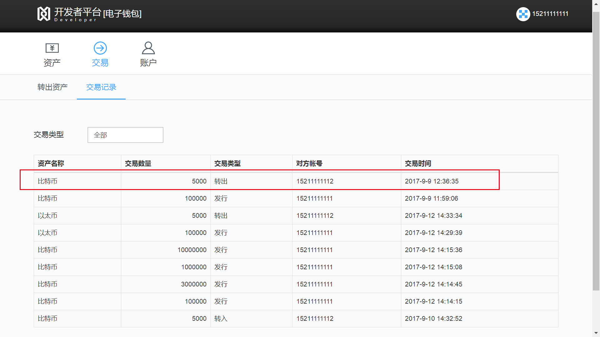
* 账户2交易记录
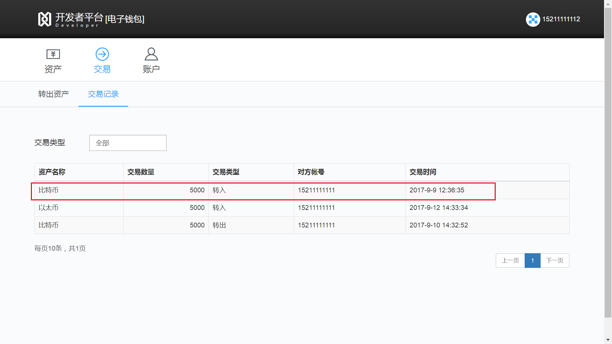
